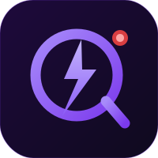

<p align="center">
  
</p>

# QuizLive — Open Source Real-Time Quiz App (Kahoot / Slido / Mentimeter Alternative)

**Open source. Self-hosted. No subscriptions. No player accounts. Unlimited questions.**

QuizLive is a free, open-source, real-time multiplayer quiz and trivia platform built with React and Firebase. Run it on your laptop for a classroom, deploy it on a server for a public event, or self-host it however you want. You own the code, you own the data, you keep the players.

> Looking for an **open source Kahoot alternative**? A **free Slido alternative**? A **self-hosted Mentimeter** for classrooms, conferences, town halls, or trivia nights? A **live polling tool** without a paywall? This is it.

**Use it for:** classroom quizzes · school trivia · corporate town halls · conference Q&A · pub trivia · live polling · audience response · community quiz nights · onboarding games · workshop icebreakers.


---

## 🆚 Why QuizLive?

| | QuizLive | Kahoot | Slido |
|--|---------|--------|-------|
| Open source | ✅ Yes | ❌ No | ❌ No |
| Self-hostable | ✅ Yes | ❌ No | ❌ No |
| No monthly subscription | ✅ Yes | ❌ $17+/mo | ❌ $15+/mo |
| No player accounts | ✅ Yes | ✅ Yes | ✅ Yes |
| No vendor lock-in | ✅ Your data | ❌ Their servers | ❌ Their servers |
| Works on local network | ✅ Offline-capable | ❌ Requires internet | ❌ Requires internet |
| Unlimited questions | ✅ Yes | ⚠️ Paid plan | ⚠️ Paid plan |

---

## ✨ What it does

- 📱 Players join from their phones — scan a QR or visit a URL, no account needed
- 🖥️ Host screen runs on the projector — live answer chart, timer, leaderboard podium
- 🎛️ Admin panel controls everything — questions, game flow, QR toggle, session history
- ⚡ Scores are time-weighted — faster correct answers earn more
- 📋 Full session history saved automatically — download any past leaderboard as CSV
- 🌐 Works offline on a local network — no internet required

---

## 📸 Screenshots

_Coming soon._

---

## 🚀 Getting Started

Pick the setup that fits your situation:

| Method | Best for | Cost |
|--------|----------|------|
| [🏠 Local + Private Network](docs/deploy-local.md) | Classroom, office, events on same Wi-Fi | $0 — truly free |
| [☁️ AWS EC2](docs/deploy-aws.md) | Public quiz, full control, your own server | ~$0 free tier |
| [🔥 Firebase + Vercel](docs/deploy-free.md) | Easiest cloud setup, up to 100 players free | $0 up to 100 players |
| [🐳 Docker](docs/deploy-docker.md) | Self-hosted, clean environment | $0 |

> **On Firebase costs:** Firebase is the database. Free tier covers up to ~100 simultaneous players. Beyond that, Blaze pay-as-you-go kicks in — roughly $5–7/month for 500 players at 3 sessions/day. You control your own Firebase project and billing. For local or AWS setups, costs depend only on your own server.

---

### ⚡ Quickstart (localhost)

```bash
git clone https://github.com/sivasooryagiri/quizlive.git
cd quizlive
npm install
cp .env.example .env
# fill in your Firebase config
npm run dev
```

Open `http://localhost:5173`

> Full Firebase setup guide → [docs/deploy-local.md](docs/deploy-local.md)

---

### 🐳 Docker

```bash
git clone https://github.com/sivasooryagiri/quizlive.git
cd quizlive
cp .env.example .env
# fill in your Firebase config in .env

docker build -t quizlive .
docker run -p 3000:3000 --env-file .env quizlive
```

Open `http://localhost:3000`

---

## 🗺️ Pages

| Path | Access | Purpose |
|------|--------|---------|
| `/` | Open — no login needed | Join and answer on their phones |
| `/host` | Open — meant for the projector/big screen | Live question display, timer, leaderboard |
| `/admin` | Admin password required | Questions, game control, history, QR toggle |
| `/about` | Open — no login needed | About the project and builder |

---

## 👥 Capacity

All deployments use Firebase Firestore as the database — capacity depends on your Firebase plan, not where the frontend is hosted.

| Firebase plan | Concurrent players | Cost |
|---------------|--------------------|------|
| Spark (free) | ~80–100 | $0 |
| Blaze (pay-as-you-go) | 500+ | ~$5–7/month at heavy use (3 sessions/day, 500 players) |

> The frontend host (Local / Docker / AWS / Vercel) only serves static files — it has no real player limit. The bottleneck is always Firestore concurrent connections.

---

## 🛠️ Tech stack

- **Frontend** — React 18, Vite, Tailwind CSS, Framer Motion
- **Database** — Firebase Firestore (real-time listeners)
- **Auth** — Firebase Authentication (admin), no player accounts
- **Hosting** — Vercel (or self-hosted)
- **Charts** — Recharts (answer bar chart)
- **QR** — qrcode.react

---

## ⚖️ License & use

Open source. Free to use, modify, and self-host.

**Not for commercial or monetary use.** Do not sell access, charge players, bundle into a paid product, or use as a revenue-generating service. Built to make quizzes free and accessible — keep it that way.

Personal use, education, internal events, community quizzes — all fine.

---

## 🗓️ Roadmap

Things planned or worth building next:

**🎨 Presentation themes**
Multiple visual themes for the host/projector screen — dark, light, high-contrast, branded. Selectable per session from the admin panel.

**💬 Room mood / word cloud**
Players type any word during a session. Words appear as floating bubbles on the host screen — the more a word is typed, the bigger its bubble. A lightweight way to feel the room before or between questions.

**More ideas worth adding**
- [ ] 🖼️ Image questions — attach an image to a question
- [ ] 👥 Team mode — group players into teams, score aggregated
- [ ] 🔢 Custom scoring — let admin set points per question
- [ ] ⏱️ Timed lobby — auto-start after countdown
- [ ] 📥 Question import — paste a JSON or CSV to bulk-add questions
- [ ] 🔔 Webhook on session end — post results to Slack, Discord, or a URL

---

## 🔍 Use cases

- 🏫 **Teachers** — run classroom quizzes, no Kahoot subscription needed
- 🏢 **Teams** — replace Slido for internal events and town halls
- 🎉 **Events** — trivia nights, conferences, community meetups
- 🖥️ **Self-hosters** — full control, runs on your own hardware
- 🌐 **Offline use** — works on a local network with no internet

---

## 👤 About

Built by [SivaSoorya G.R](https://deadtechguy.fun) — ML/DL creator, co-founder of Soluto. Opened this up so anyone can run a quiz without a paywall or a vendor in the way.

→ [deadtechguy.fun](https://deadtechguy.fun) · [GitHub](https://github.com/sivasooryagiri) · 📧 [dtg@soluto.in](mailto:dtg@soluto.in)

---

## 🤖 Build credits

This release was built with [Claude Code](https://claude.com/claude-code) using **Claude Sonnet 4.6** and **Claude Opus 4.7**.

---

<sub>**Topics:** quiz · trivia · kahoot-alternative · slido-alternative · mentimeter-alternative · open-source-quiz · self-hosted · real-time · multiplayer · classroom · live-polling · audience-response · firebase · react · vite · tailwindcss · free-quiz-app · no-subscription</sub>
